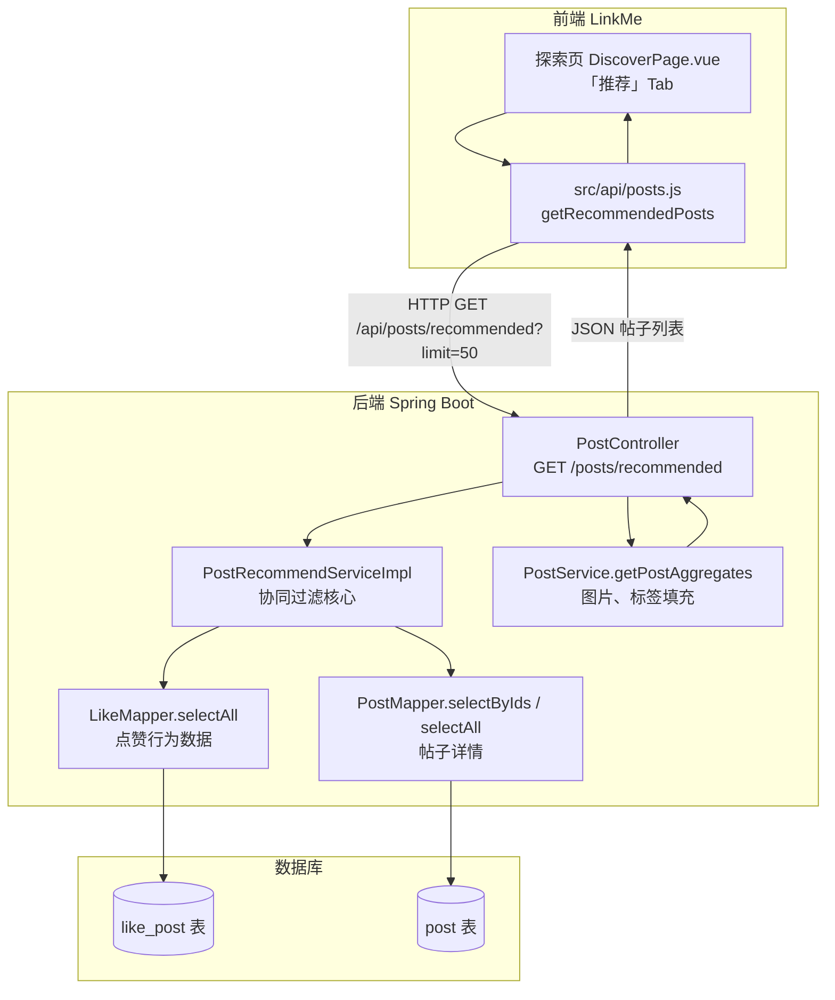
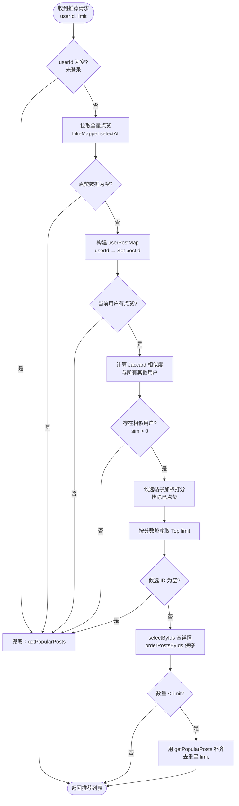
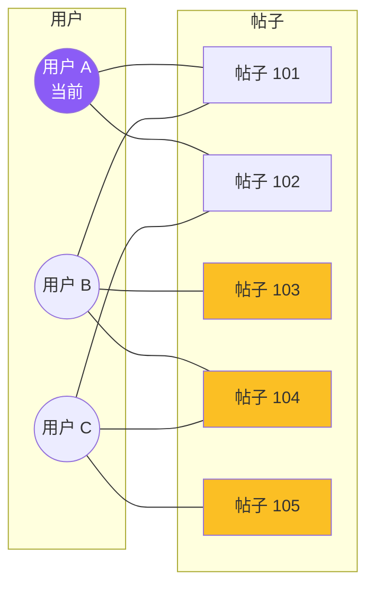
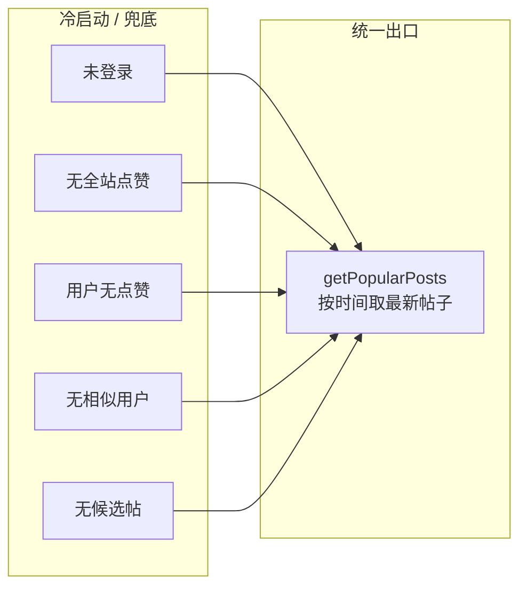
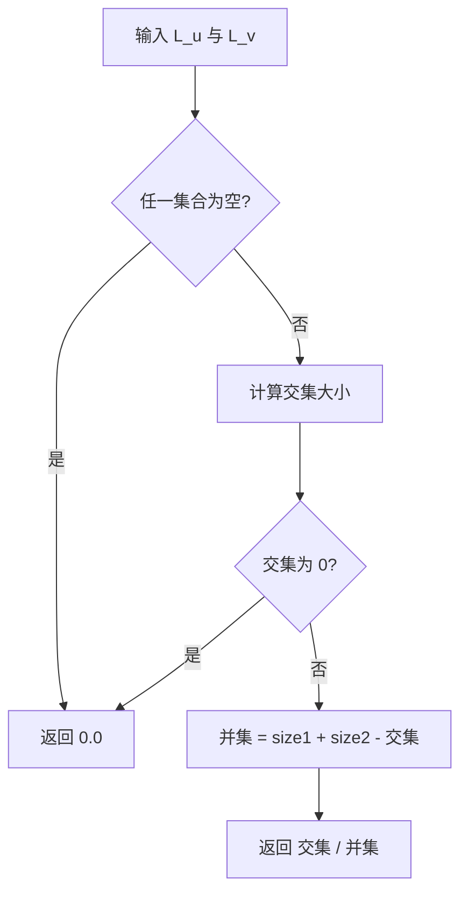
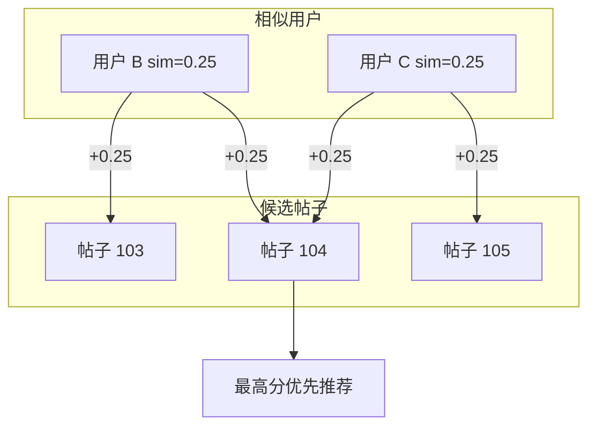
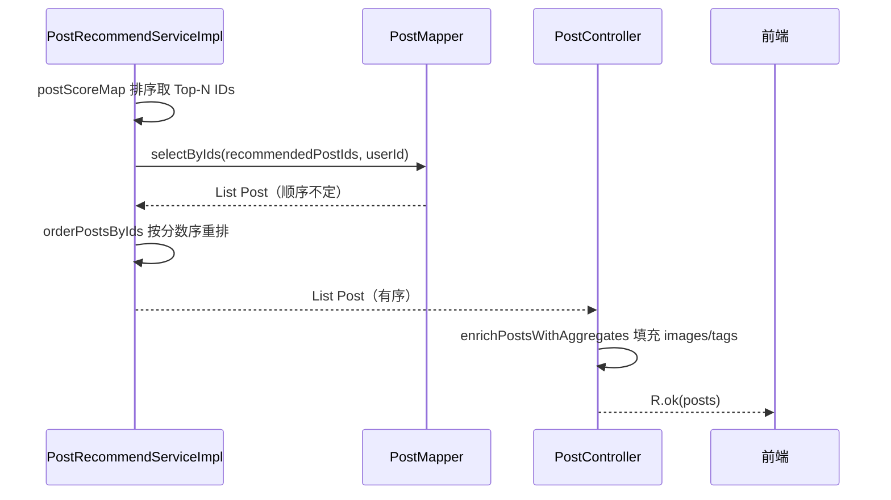
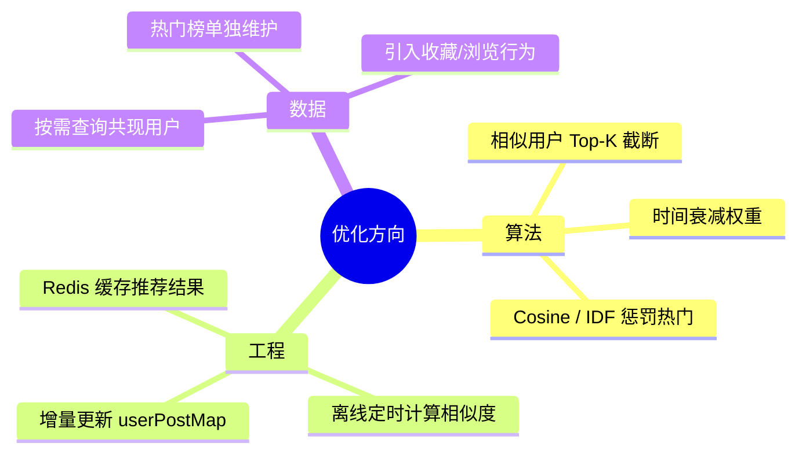

# 帖子推荐：基于用户的协同过滤算法说明（User-Based CF）

本文档描述 LinkMe「探索页 · 推荐」所使用的**基于用户的协同过滤（User-Based Collaborative Filtering）**实现，涵盖前后端调用链、算法细节、兜底策略与优化方向，便于维护、答辩说明与后续迭代。

---

## 1. 功能概述

### 1.1 要解决什么问题？

在探索页为用户展示**可能感兴趣、但尚未点赞过**的帖子。系统不依赖帖子正文向量或标签语义，而是利用**群体点赞行为**推断用户口味：

> 「和我点赞习惯相似的人喜欢的帖子，我也可能喜欢。」

### 1.2 算法类型

| 项目 | 说明 |
|------|------|
| 算法族 | 协同过滤（Collaborative Filtering） |
| 子类型 | **User-Based CF**（基于用户相似度） |
| 行为信号 | 点赞（Like），视为**隐式反馈**（看过且认可，无显式评分） |
| 相似度度量 | **Jaccard 相似系数**（共同点赞占比） |
| 推荐策略 | 相似用户点赞过、当前用户未点赞的帖子，按相似度加权打分 |

### 1.3 与「匹配推荐」的区别

| 功能 | 接口 | 算法 |
|------|------|------|
| **帖子推荐**（本文档） | `GET /posts/recommended` | 点赞协同过滤 |
| 用户匹配推荐 | `GET /match/recommendations` | 问卷规则打分（非协同过滤） |

二者相互独立，请勿混淆。

---

## 2. 系统架构与代码位置

### 2.1 端到端调用链



### 2.2 关键文件一览

| 层级 | 文件 | 职责 |
|------|------|------|
| 前端页面 | `LinkMe/src/views/DiscoverPage.vue` | 「推荐」Tab 调用协同过滤；「关注」Tab 仍用普通列表 |
| 前端 API | `LinkMe/src/api/posts.js` | `getRecommendedPosts(limit)` 封装 |
| 控制器 | `PostController.java` | 暴露 `GET /posts/recommended`，填充 images/tags |
| 服务接口 | `PostRecommendService.java` | `getRecommendedPosts(userId, limit)` |
| **核心实现** | `PostRecommendServiceImpl.java` | Jaccard 相似度 + 加权打分 + 兜底 |
| 点赞数据 | `LikeMapper.java` | `selectAll()` 拉取全量点赞 |
| 帖子数据 | `PostMapper.xml` | `selectByIds`、`selectAll` |
| 说明文档 | `帖子推荐-协同过滤算法说明.md` | 本文档 |

---

## 3. API 说明

### 3.1 请求

```
GET /api/posts/recommended?limit=20
```

| 参数 | 类型 | 默认 | 说明 |
|------|------|------|------|
| `limit` | int | 20 | 返回帖子数量上限，后端限制 **1～100** |

**认证**：可选。携带 `Authorization: Bearer <token>` 时解析 `userId` 做个性化推荐；未登录时 `userId = null`，走兜底。

**权限**：`JwtInterceptor` 对 `GET /posts/**` 放行，未登录也可访问。

### 3.2 响应

统一格式 `R<List<Post>>`，每条 `Post` 包含：

- 基础字段：`postId`、`userId`、`topic`、`content`、`createdAt`
- 作者信息：`nickname`、`username`、`avatarUrl`
- 统计：`likeCount`、`commentCount`、`favoriteCount`
- 关系：`isFollowed`（当前用户是否关注作者）
- 聚合：`images`（Base64 列表）、`tags`（标签 ID 列表）

### 3.3 前端集成要点

```javascript
// src/api/posts.js
export async function getRecommendedPosts(limit = 20) {
  const res = await request({ url: "/posts/recommended", method: "get", params: { limit } });
  return Array.isArray(res) ? res : res?.data || [];
}
```

探索页行为：

- **推荐 Tab** → `getRecommendedPosts(50)`
- **关注 Tab** → `getPosts()` + 前端按 `isFollowed` 过滤
- **点赞后** → 自动重新请求推荐列表（点赞会改变协同过滤输入）

---

## 4. 算法总览流程图



---

## 5. 数据建模

### 5.1 隐式反馈矩阵（概念模型）

将每个用户的点赞集合记为：

\[
L_u = \{ \text{postId} \mid \text{用户 } u \text{ 点赞过该帖子} \}
\]

在内存中维护：

```text
userPostMap: Map<userId, Set<postId>>
```

**示例**（3 个用户、5 篇帖子）：

| 用户 | 点赞帖子 ID |
|------|-------------|
| A（当前用户） | {101, 102} |
| B | {101, 103, 104} |
| C | {102, 104, 105} |

### 5.2 用户-物品二分图（直观理解）



- 用户 A 已点赞：101、102（灰色已有，不再推荐）
- 用户 B、C 与 A 有共同点赞 → 可计算相似度
- **候选推荐**：103、104、105（相似用户点赞过、A 未点赞）

---

## 6. 算法步骤详解

### 6.1 步骤一：冷启动与兜底判断

以下任一条件成立时，**跳过协同过滤**，直接调用 `getPopularPosts(userId, limit)`：

| 条件 | 典型场景 |
|------|----------|
| `userId == null` | 游客浏览探索页 |
| 全站无点赞 | 新系统、测试库为空 |
| 当前用户 `L_u` 为空 | 新注册用户从未点赞 |
| 无相似用户 `sim(u,v) > 0` | 点赞口味独特，无共同点赞 |
| 候选帖子集合为空 | 相似用户点赞的帖子当前用户全都点过赞了 |



当前 `getPopularPosts` 实现为 `postMapper.selectAll(0, limit, userId)`，按**创建时间降序**，作为「热门/最新」的轻量近似（非严格按点赞数排序）。

---

### 6.2 步骤二：用户相似度（Jaccard）

对目标用户 \(u\) 与每个其他用户 \(v \ne u\)：

\[
\text{sim}(u, v) = \frac{|L_u \cap L_v|}{|L_u \cup L_v|}
\]

**含义**：共同点赞占「双方点赞并集」的比例。值域 \([0, 1]\)，仅保留 \(\text{sim} > 0\) 的用户。

**接上例**（A 为目标用户）：

| 用户对 | 交集 | 并集 | Jaccard |
|--------|------|------|---------|
| A ∩ B | {101} | {101,102,103,104} | 1/4 = **0.25** |
| A ∩ C | {102} | {101,102,104,105} | 1/4 = **0.25** |

实现：`calculateJaccardSimilarity(Set<Integer> set1, Set<Integer> set2)`



---

### 6.3 步骤三：候选帖子打分

遍历每个相似用户 \(v\) 及其相似度 \(\text{sim}(u,v)\)，对其点赞的每个帖子 \(p\)：

- 若 \(p \notin L_u\)（当前用户未点赞）→ 纳入候选
- 累加分数：

\[
\text{score}(p) = \sum_{v \in S(u)} \text{sim}(u,v) \cdot \mathbb{I}[p \in L_v \land p \notin L_u]
\]

其中 \(S(u)\) 为与 \(u\) 相似的用户集合，\(\mathbb{I}[\cdot]\) 为指示函数。

**接上例打分**：

| 帖子 | 来源 | 得分计算 | score |
|------|------|----------|-------|
| 103 | 仅 B 点赞 | 0.25 | **0.25** |
| 104 | B、C 均点赞 | 0.25 + 0.25 | **0.50** |
| 105 | 仅 C 点赞 | 0.25 | **0.25** |

**推荐排序**：104 > 103 = 105



实现：`postScoreMap: Map<postId, Double>`，累加 `similarity`。

---

### 6.4 步骤四：排序、查库与保序

1. `postScoreMap` 按 value **降序**排序，取前 `limit` 个 `postId`
2. `postMapper.selectByIds(ids, userId)` 批量查帖子（含作者、点赞数、关注状态）
3. **`orderPostsByIds`**：SQL `IN` 子句不保证顺序，按分数序重排后返回



---

### 6.5 步骤五：数量不足时补齐

若协同过滤结果 `size < limit`（例如部分帖子已删除、审核隐藏）：

1. 调用 `getPopularPosts` 再取一批
2. 用 `Set<postId>` 去重
3. 依次追加直到满 `limit` 或热门列表耗尽

日志字段（便于排查）：

```text
PostRecommend: userId=... similarUserCount=... candidatePostCount=...
               initialRecommended=... fallbackUsed=... finalRecommended=...
```

---

## 7. 完整数值示例（走通一遍）

**场景**：用户 Alice（id=1）请求 `limit=3`

| 用户 | 点赞帖子 |
|------|----------|
| Alice | {10, 20} |
| Bob | {10, 30, 40} |
| Carol | {20, 40, 50} |
| Dave | {99}（与 Alice 无交集，不参与） |

**相似度**：

- sim(Alice, Bob) = |{10}| / |{10,20,30,40}| = 1/4 = 0.25
- sim(Alice, Carol) = |{20}| / |{10,20,40,50}| = 1/4 = 0.25

**候选与得分**（排除 10、20）：

| postId | 得分 |
|--------|------|
| 40 | 0.25 + 0.25 = **0.50** |
| 30 | 0.25 |
| 50 | 0.25 |

**最终推荐顺序**：40 → 30 → 50（若 limit=3 刚好满）

---

## 8. 算法特点与适用边界

### 8.1 优点

- **可解释性强**：「因为你和某某用户点赞习惯相似」
- **实现简洁**：无需 NLP、Embedding 或标签体系
- **冷启动有兜底**：总能返回帖子，探索页不会空白

### 8.2 局限

| 问题 | 说明 |
|------|------|
| 冷启动 | 新用户无点赞 → 长期走兜底 |
| 稀疏性 | 点赞少时相似用户难找 |
| 热门偏置 | 共同点赞易集中在热门帖，推荐易趋同 |
| 扩展性 | 每次 `selectAll()` 全量点赞，用户/行为增多后变慢 |
| 实时性 | 每次请求现场计算，无预计算缓存 |
| 兜底语义 | 当前兜底偏「最新」而非严格「最热」 |

---

## 9. 复杂度与性能

记：

- \(M\)：点赞记录总数
- \(U\)：有点赞的用户数
- \(|L_u|\)：目标用户点赞数

| 阶段 | 复杂度（量级） |
|------|----------------|
| 构建 `userPostMap` | \(O(M)\) |
| 计算全部用户相似度 | \(O\left(\sum_{v \ne u} \min(|L_u|, |L_v|)\right)\) |
| 候选打分 | \(O\left(\sum_{v \in S(u)} |L_v|\right)\) |
| 排序 Top-N | \(O(P \log P)\)，\(P\) 为候选帖数 |

**主要瓶颈**：全量 `selectAll()` + 对所有用户遍历相似度。

---

## 10. 可选优化方向（按优先级）



1. **相似用户 Top-K**：只对相似度最高的 K 个用户打分，降噪提速  
2. **时间衰减**：近期点赞权重更高  
3. **改进相似度**：Cosine、或对高频帖子做 IDF 惩罚  
4. **离线 + 缓存**：定时任务预计算，接口读缓存  
5. **查询优化**：从「当前用户点赞过的帖子」反查共现用户，避免全表扫描  
6. **真正热门兜底**：按 `likeCount` 聚合或维护热门榜表  

---

## 11. 测试与验证建议

### 11.1 手工验证步骤

1. 准备账号 A、B，让两者**点赞相同帖子** 1～2 篇  
2. 让 B **额外点赞**帖子 X，A 未点赞 X  
3. A 登录，打开探索页「推荐」Tab  
4. 预期：X 出现在 A 的推荐列表中，且排名可能随 B 的相似度升高而靠前  

### 11.2 兜底验证

- 未登录访问 → 应返回最新帖子列表  
- 新账号零点赞 → 同上  

### 11.3 观察日志

搜索关键字 `PostRecommend:`，关注 `similarUserCount`、`candidatePostCount`、`fallbackUsed`。

---

## 12. 版本记录

| 版本 | 日期 | 变更 |
|------|------|------|
| 1.0 | 2025-12 | 初版：User-Based CF + Jaccard |
| 1.1 | 2026-07 | 前端接入探索页；`orderPostsByIds` 保序；推荐接口填充 images/tags；文档扩充与流程图 |

---

## 附录：核心伪代码

```text
function getRecommendedPosts(userId, limit):
    if userId is null: return getPopularPosts(null, limit)

    allLikes = likeMapper.selectAll()
    if allLikes is empty: return getPopularPosts(userId, limit)

    userPostMap = buildUserPostMap(allLikes)
    Lu = userPostMap[userId] or empty
    if Lu is empty: return getPopularPosts(userId, limit)

    similarityMap = {}
    for each (v, Lv) in userPostMap where v != userId:
        sim = jaccard(Lu, Lv)
        if sim > 0: similarityMap[v] = sim

    if similarityMap is empty: return getPopularPosts(userId, limit)

    postScores = {}
    for each (v, sim) in similarityMap:
        for each postId in userPostMap[v]:
            if postId not in Lu:
                postScores[postId] += sim

    topIds = sortDesc(postScores).take(limit)
    if topIds is empty: return getPopularPosts(userId, limit)

    posts = orderPostsByIds(selectByIds(topIds), topIds)

    if posts.size < limit:
        pad with getPopularPosts, dedupe until limit

    return posts
```
